  

# 🏗️ Awesome Construction Site Analytics & Intelligence 📊

  
  
  
  
  

> 🚀 **Curated Directory of Commercial SaaS Platforms, Progress AI Tools, Reality-to-BIM Pipelines, Drone Mapping Software, and Open-Source Construction Computer Vision Projects.**

Welcome to the **Awesome Construction Site Analytics** ecosystem! This repository tracks market-leading commercial **SaaS platforms** and production-grade **open-source GitHub projects** designed for real-time site intelligence, 360° progress tracking, computer vision safety analysis, drone photogrammetry, and BIM comparison.

---

## 📑 Table of Contents

- [📈 Market Intelligence & Overview](#-market-intelligence--overview)
- [💼 SaaS / Hosted Platforms](#-saas--hosted-platforms)
- [🛠️ Open-Source GitHub Projects](#%EF%B8%8F-open-source-github-projects)
- [🤝 How to Contribute](#-how-to-contribute)
- [💖 Support & Sponsorship](#-support--sponsorship)
- [📈 Star History](#-star-history)
- [⚠️ Disclaimer](#%EF%B8%8F-disclaimer)

---

## 📈 Market Intelligence & Overview

> 💡 **Market Size & Structure:** The global **Construction Site Analytics & Reality Capture** market is estimated at **$3.5 Billion (2026)** and is projected to reach **$8.2 Billion by 2030** (CAGR ~18.5%). The sector is **moderately fragmented**, undergoing rapid consolidation as large general enterprise platforms (e.g., Procore) acquire specialized niche vision and drone providers (e.g., DroneDeploy), while category-defining Progress AI startups (e.g., Buildots, OpenSpace) scale toward unicorn valuations.

---

## 💼 SaaS / Hosted Platforms

| SaaS Platform 🏢 | Valuation / Company Size 📊 | Pricing Tier (Starting) 💵 | Free Tier / Trial Limit ⏳ | Description & Core Focus 🎯 |
| :--- | :--- | :--- | :--- | :--- |
| **[Procore Analytics](https://www.procore.com/)** 🏗️ | **$7.5B Market Cap** (NYSE: PCOR; ~$1.42B Rev) | Custom ACV-based (Starts ~$4,500/yr) | 14-Day Free Demo / No Free Plan | Enterprise construction management & portfolio analytics platform. |
| **[Buildots](https://www.buildots.com/)** 🤖 | **$1.0B Valuation** ($297M Raised) | Custom Sq.Ft / ACV Tier (Starts ~$15,000/yr) | Custom Single-Floor Pilot Scan / No Free Plan | AI & wearable 360° camera computer vision for automated progress tracking. |
| **[OpenSpace](https://www.openspace.ai/)** 📸 | **$902M Valuation** ($199M Raised) | Custom ACV Tier (Starts ~$10,000/yr minimum) | Free OpenSpace Academy Access / No Free Plan | 360° photo capture, site documentation, and automated progress tracking. |
| **[DroneDeploy](https://www.dronedeploy.com/)** 🛸 | **$845M Acquisition** (Acquired by Procore 2026; ~$78M Rev) | $4,188/year (Individual Plan) | 14-Day Free Trial (No Credit Card required) | Drone aerial mapping, 3D modeling, robotics, and ground site inspection. |
| **[Versatile](https://www.versatile.ai/)** 🏗️ | **$250M+ Est. Valuation** ($109M Raised) | Custom Crane-based Pricing (Starts ~$20,000/project) | Custom Crane Deployment Pilot / No Free Plan | Crane-mounted CraneView AI sensors measuring hook time, loads, and site pace. |
| **[HammerTech](https://www.hammertech.com/)** 🛡️ | **$150M+ Est. Valuation** ($77.1M Raised) | Custom Site-Volume Tier (Starts ~$5,000/yr) | 14-Day Product Demo Trial / No Free Plan | Construction safety, EHS, subcontractor compliance, and site risk analytics. |
| **[Doxel](https://www.doxel.ai/)** 📊 | **$120M+ Est. Valuation** ($56.5M Raised) | Custom Sq.Ft Pricing (Starts ~$12,000/project) | Custom Single-Zone AI Pilot / No Free Plan | Predictive project controls & computer vision comparing installed work vs BIM. |
| **[WakeCap](https://www.wakecap.com/)** 👷 | **$80M+ Est. Valuation** ($32M Raised) | Custom Wearable Unit Tier (Starts ~$5/worker/month) | 30-Day On-Site Hardware Pilot / No Free Plan | Hard-hat wearable sensors for worker safety, attendance, and site movement. |
| **[Disperse](https://www.disperse.io/)** 🔍 | **Acquired** (Acquired by OpenSpace 2025; $31M Raised) | Custom Project Scope Tier (Starts ~$8,000/project) | Custom Demo & Pilot Evaluation / No Free Plan | Visual documentation and AI progress control integrating project schedules. |
| **[Avvir](https://www.avvir.io/)** 📐 | **Acquired** (Acquired by Hexagon 2022; $15M Raised) | Custom Scan Processing Tier (Starts ~$6,000/project) | Custom Sample Laser Scan Demo / No Free Plan | Laser scan point cloud to BIM automated verification and continuous inspection. |

---

## 🛠️ Open-Source GitHub Projects

Sorted by **GitHub Stars_Count** (descending) 🌟:

- **[OpenDroneMap/ODM](https://github.com/OpenDroneMap/ODM)** 🛸  
    
  *Leading open-source photogrammetry toolkit for processing drone imagery into orthomosaics, point clouds, elevation models, and 3D meshes for construction job sites.*

- **[CloudCompare/CloudCompare](https://github.com/CloudCompare/CloudCompare)** ☁️  
    
  *3D point cloud and triangular mesh processing software equipped with advanced distance comparison algorithms to detect as-built variances against BIM models.*

- **[OpenDroneMap/WebODM](https://github.com/OpenDroneMap/WebODM)** 🌐  
    
  *User-friendly web application, API, and visual interface built around OpenDroneMap for team drone mapping and geospatial site analytics.*

- **[ultralytics/ultralytics](https://github.com/ultralytics/ultralytics)** 🧠  
    
  *YOLOv8/YOLO11 real-time computer vision models widely deployed on construction sites for PPE compliance (hard hats, safety vests), worker tracking, and heavy equipment monitoring.*

- **[thatopen/engine](https://github.com/thatopen/engine)** 🧱  
    
  *High-performance web-based OpenBIM IFC geometry engine (formerly IFC.js) designed to build lightweight browser-based 3D BIM progress visualization tools.*

- **[PDAL/PDAL](https://github.com/PDAL/PDAL)** 📐  
    
  *Point Data Abstraction Library (PDAL) for translating, filtering, segmenting, and processing massive LiDAR and point cloud datasets from construction scans.*

- **[openvdb/fvdb-reality-capture](https://github.com/openvdb/fvdb-reality-capture)** 📦  
    
  *Sparse spatial intelligence framework and open reality-capture toolbox for large-scale 3D visual data processing, volumetric meshes, and point clouds.*

---

## 🤝 How to Contribute

We welcome contributions from construction technologists, VDC managers, and open-source developers! 

1. 🍴 **Fork** this repository.
2. 📝 **Add/edit** entries in `README.md` following the existing tabular or badge format.
3. 🔗 Include accurate factual details, official homepage or GitHub links, and pricing details.
4. 🚀 Submit a **Pull Request (PR)** with a clear title and description.

---

## 💖 Support & Sponsorship

If you find this repository valuable for your research, job site tech stack evaluation, or open-source projects, please consider supporting us:

- ⭐ **Star this repository** to help others discover it!
- 🔀 **Fork & Share** with your team and network.
- ☕ **Buy me a coffee / Sponsor:** [GitHub Sponsor Dashboard](https://github.com/sponsors/ishandutta2007)

Thank you for supporting open construction technology! 🙏

---

## 📈 Star History

---

## ⚠️ Disclaimer

- This repository is a **community-curated index** for informational and educational purposes only.
- Company valuations, revenue estimations, and subscription baseline costs are gathered from public filings, press releases, and industry benchmarks.
- Site analytics directly impact schedule verification, payment approvals, and job site safety decisions; open-source projects should undergo proper QA testing before deployment in production environments.

---

  Made with ❤️ for Construction Technologists, VDC Engineers, and Reality-Capture Advocates.

